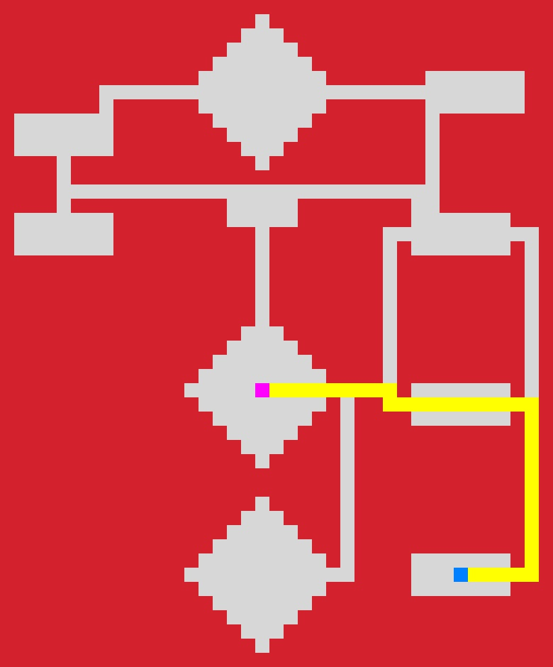
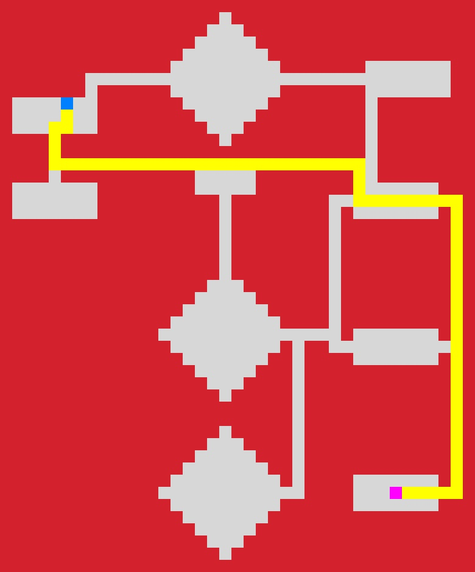
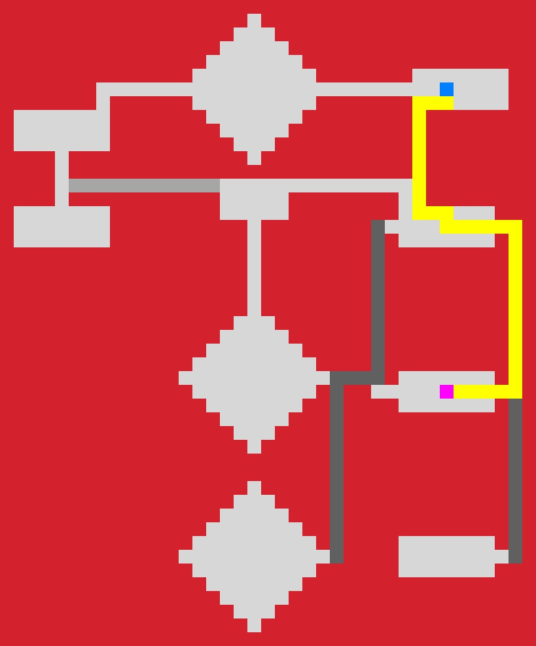
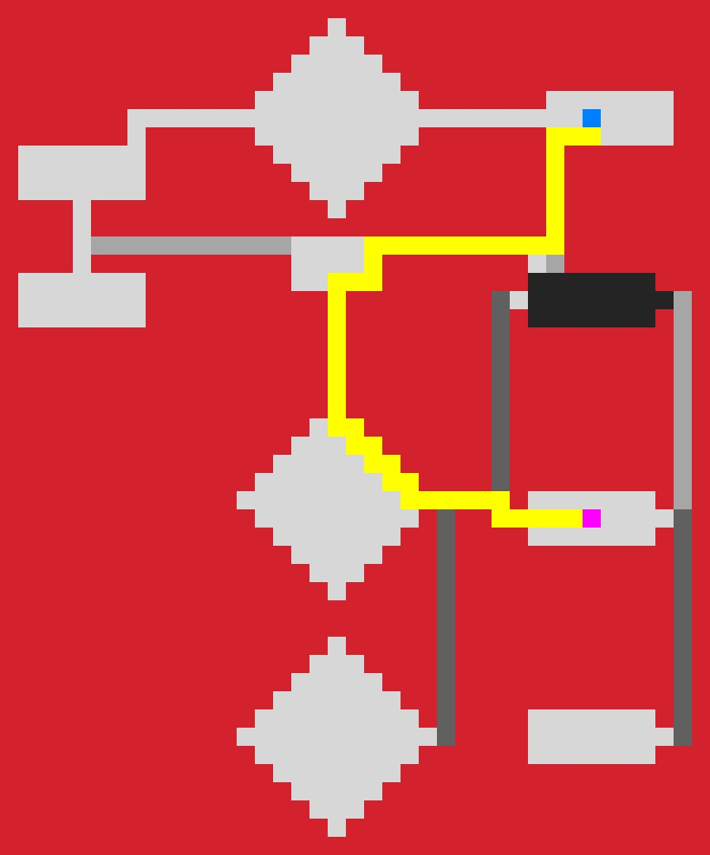
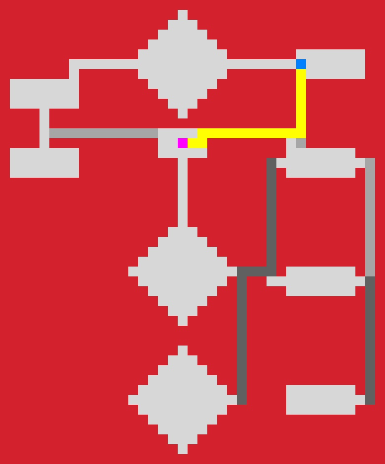

# Assignment 2: Applying the A* search

## How to run:

### Step 1: Navigate into src folder
```bash
cd src
```
### Step 2: Run the main method with the corresponding task number:
```bash
python3 main.py <tasknr>
```

# Part 1 – Grid with obstacles
## Task 1 - find the shortest path from Rundhallen (your location) to Strossa
### Run:
```bash
python3 main.py 1
```
### Output:


## Task 2 - find the shortest path from Strossa to Selskapssiden
### Run:
```bash
python3 main.py 2
```
### Output:


# Part 2 – Grids with different costs
## Task 3 - find the path from Lyche to Klubben with the least cost
### Run:
```bash
python3 main.py 3
```
### Output:


## Task 4 - find the new least-cost path from Lyche to Klubben, now considering the cake party at Edgar
### Run:
```bash
python3 main.py 4
```
### Output:


# Part 3 – Moving Goal (Optional)
## Task 5 - find your friend who will be starting out at Klubben and moving towards Selskapssiden
### Run:
```bash
python3 main.py 5
```
### Output:


