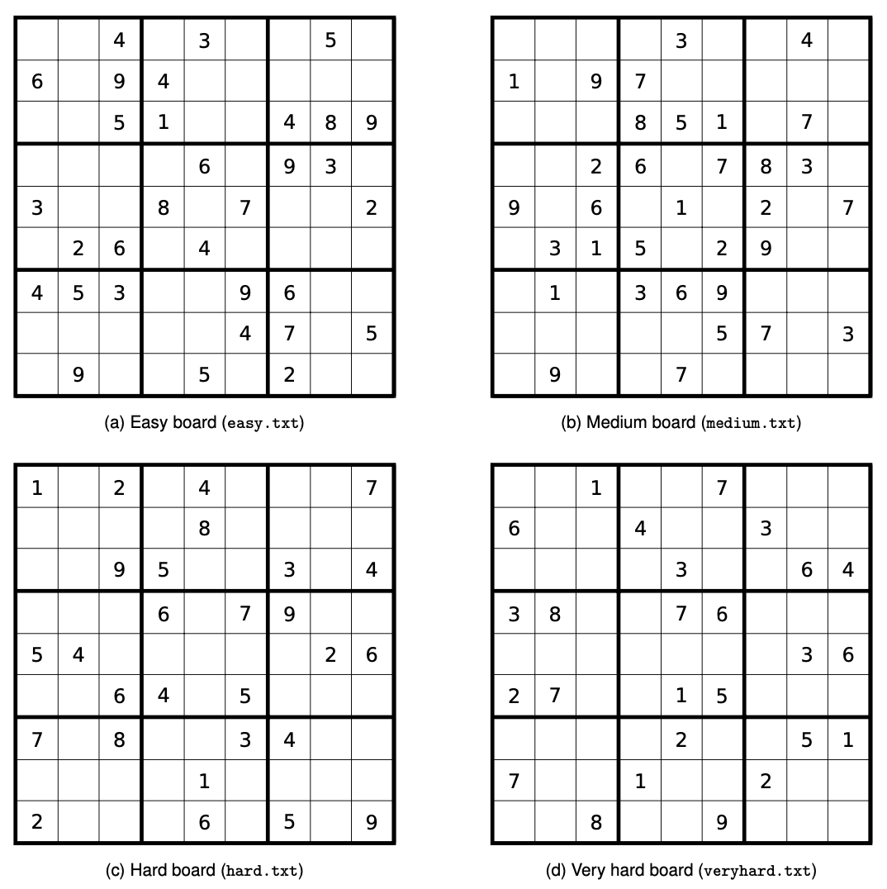
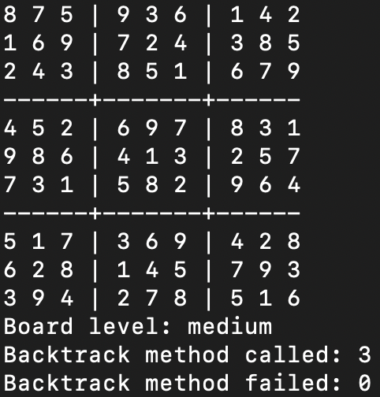
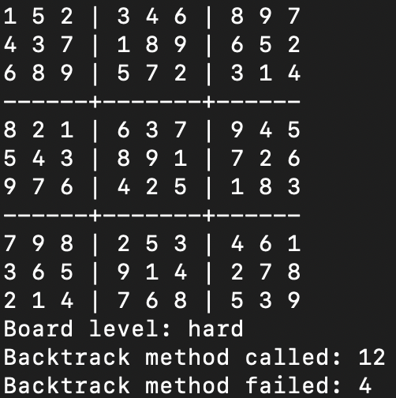
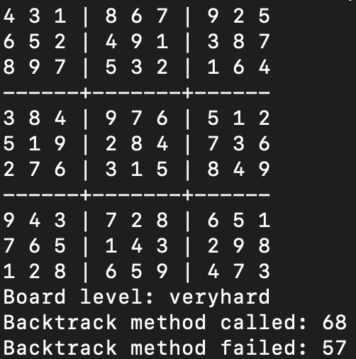

# Assignment 4: Constraint Satisfaction Problems

## How to run:

### Step 1: Navigate into src folder
```bash
cd src
```
### Step 2: Run the main method with the corresponding level (easy, medium, hard, veryhard):
```bash
python3 main.py <level>
```

## Boards to be solved


## Board solutions calculated by program






