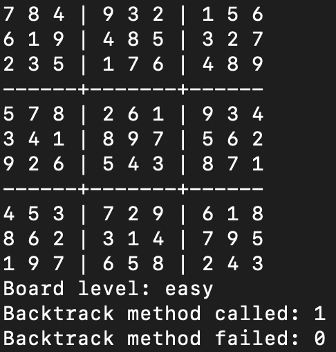

# Assignment 4: Constraint Satisfaction Problems

## Overview
Implementation for a general solver for Constraint Satisfaction Problems using back - tracking search and the arc-consistency algorithm AC-3. This program is used to solve Sudoku boards of varying difficulty.

## How to run:

### Step 1: Navigate into src folder
```bash
cd src
```
### Step 2: Run the main method with the corresponding level (easy, medium, hard, veryhard):
```bash
python3 main.py <level>
```

## Boards to be solved


## Board solutions calculated by program




## Reflection

In the results above we first see that the program outputs a valid solution for all the fours sudoku boards. When we compare the number of times the backtrack function is called and fails, we see that the number of fails increases exponentially with the number of calls. That is because the number of calls to the backtrack function reflects how many times the algorithm must guess which number is in a particular state rather than infer with the AC-3 algorithm. That implies that with more difficult boards containing less numbers the algorithm must call the backtrack function more times. The more it is called the more it must guess, and with less information on the board the possibility for guessing wrong increases due to high branching.
